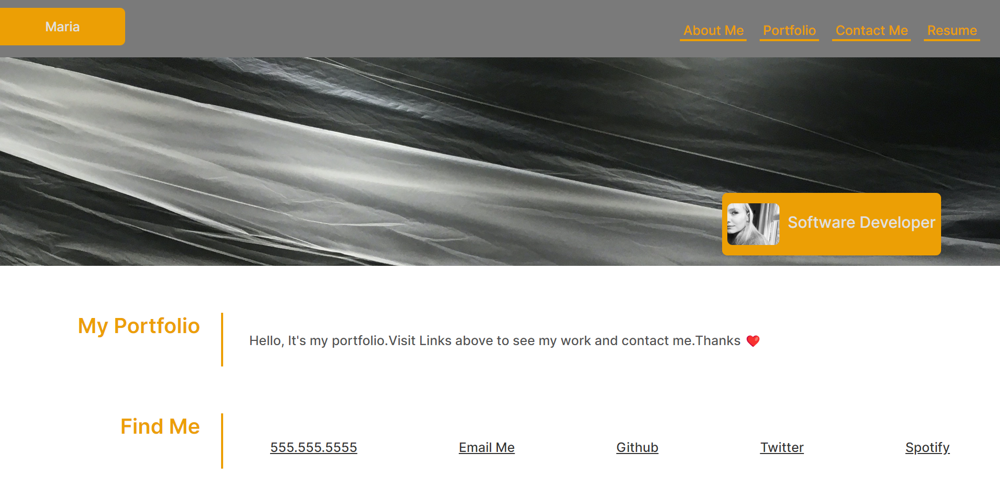
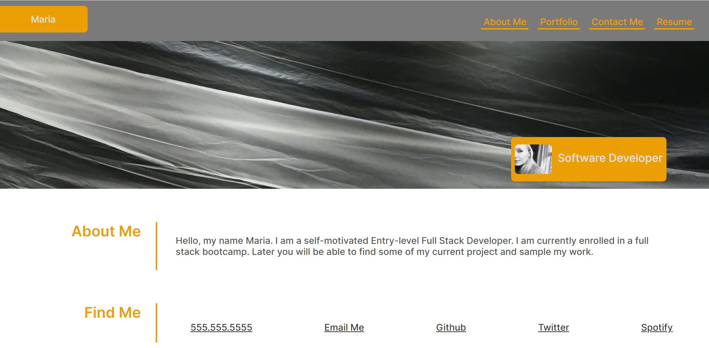

# Maria React-Portfolio

## Description
 
 This portfolio website is built up with React. Core skills including: React, Javascript and Tailwind css. It presentes with About, Projects and Contact information about me. You can also download my resume. It is designed to work with different screen sizes as you need.

 ## Installation

Download or clone repository 
-npm install to install the required npm packages 
Open VsCode Terminal 
-npm run start 
-App listening on port 3001! 
## Deploy on GitHub 
-Don't add readme file 
-in App.js change <BrowserRouter> on <HashRouter> 
-added to package json:  
"homepage": "https://username.github.io/projectname", 
- in script : 
"predeploy": "npm run build", 
"deploy": "gh-pages -d build", 
Terminal : 
-npm install 
-npm install --save-dev gh-pages 
-npm run deploy 
Back to github and you can see secound branch 
Going to settings /pages  
click on deploy url  

## Please note that Twitter LinkedIn links are empty.

## Images of Deployed Application

## Relevant Links

GitHub Repo: https://github.com/Mary90272/Maria-PR
 
Deployed Application: https://mary90272.github.io/Maria-PR/
